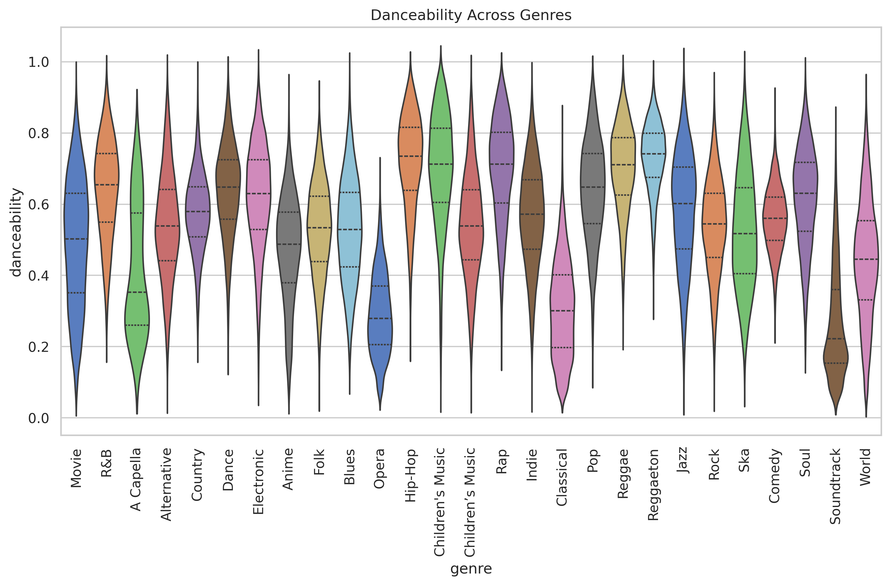

# Spotify_dataset_data_visualization_Aishwarya
I have visualized data from kaggle's spotify dataset using Matplotlib and Seaborn

📂 Dataset Description: Ultimate Spotify Tracks Dataset

Contributed by: Zaheen Hamidani on Kaggle
Shape: ~232,000 songs × 18 features
Features Include:

🎵 Track Metadata: track name, artist, id, release date
📊 Popularity: numerical score (0–100) based on streams/engagement
🎶 Audio Features: danceability, energy, loudness, speechiness, acousticness, instrumentalness, liveness, valence, tempo
⏱️ Duration: song length in milliseconds
📑 Other: mode, key, time signature
----------------------------------------------------------------------------------
📊 Chart 1: Distribution of Song Durations (Histogram)

Description:
This histogram shows how long songs typically last, measured in minutes.
Most songs fall in a narrow range, with a sharp peak in the distribution.

Insights:
🟣The majority of songs are between 2 to 5 minutes long — the standard length for popular tracks.
🟣Very few songs exceed 10 minutes; those are likely special tracks (e.g., live versions, instrumental pieces, or extended mixes).
🟣The peak around 3–4 minutes reflects the common industry preference, since songs of this length are radio-friendly and align with listener attention spans.
🟣Outliers above 20 minutes exist but are extremely rare — they may be experimental or incorrectly tagged data.

📊 Chart 2: Top 10 Artists by Number of Tracks

Description:
This bar chart shows the 10 artists with the highest number of tracks in the Spotify dataset. Each bar represents an artist and the corresponding count of their songs.

Insights:
🟣Classical composers like Giuseppe Verdi, Giacomo Puccini, Mozart dominate the dataset, likely because their compositions are often recorded in multiple albums and variations.
🟣Some modern entries like Juice Music also appear, indicating diversity in the dataset across time periods.
🟣The dominance of a few artists suggests that the dataset is skewed towards certain creators, which may influence recommendation systems if not balanced.

📊 Chart 3: Average Loudness across Genres

Description:
This line chart shows the average loudness (in decibels) of songs across different genres. Loudness is a key audio feature that represents the overall volume and intensity of a track.

Insights:
🟣Genres like Dance, Reggaeton, Rap, and Ska tend to have the highest loudness levels (closer to 0 dB), which aligns with their energetic and upbeat nature.
🟣On the other hand, genres such as Classical, Opera, and Soundtracks are much quieter on average, reflecting their dynamic range and softer compositions.
🟣The variation in loudness across genres highlights how audio engineering differs based on the mood and purpose of the music — e.g., pop and hip-hop aim for loud, radio-friendly mixes, while classical music prioritizes dynamic depth.

📊 Chart 4: Genre Distribution (Top 6)

Description:
This pie chart shows the distribution of the top 6 most common genres in the Spotify dataset. Each slice represents the percentage of songs belonging to a genre.

Insights:
🟣The top 6 genres — Comedy, Soundtrack, Indie, Jazz, Pop, and Electronic — are almost evenly distributed, each making up around 16–17% of the dataset.
🟣Comedy has a slightly higher share, indicating more songs from this category in the dataset.
🟣The near-uniform distribution suggests that the dataset maintains a balanced representation of major genres, which is useful for general-purpose analysis but may not reflect real-world streaming trends where pop/hip-hop usually dominate.

📊 Chart 5: Energy vs Danceability

Description:
This scatter plot shows the relationship between a track’s energy (how lively/intense it feels) and its danceability (how suitable it is for dancing).

Insights:
🟣Songs with medium to high energy (0.4–0.8) tend to also have higher danceability, showing a moderate positive relationship.
🟣Very low-energy songs (near 0) are rarely danceable, which matches intuition (e.g., calm or acoustic tracks).
🟣The distribution is not perfectly linear — some high-energy songs are not very danceable.

📊 Chart 6: Top 10 Genres by Average Tempo

Description:
This horizontal bar chart compares the average tempo (BPM) of the top 10 music genres.

Insights:
🟣Ska has the highest average tempo (~130 BPM), reflecting its fast-paced, energetic style.
🟣Electronic and Anime genres also trend towards higher tempos, aligning with their upbeat and vibrant nature.
🟣Genres like Children’s Music, Blues, and Pop sit on the lower side (~120 BPM), showing a calmer rhythm.
🟣The difference between the slowest and fastest genres is around 10 BPM, meaning tempo variation across genres is moderate.

📊 Chart 7: Popularity Distribution Across Genres

Description:
This boxplot illustrates the spread of popularity scores across different music genres. Each box shows the median, quartiles, and outliers for popularity within that genre.

Insights:
🟣Genres like Pop and Rock show higher median popularity, reflecting their mainstream appeal.
🟣Niche genres (e.g., Blues, Anime, Ska) may have lower median popularity but often display a wider spread, meaning some songs still achieve high popularity.
🟣The presence of outliers suggests that even in less popular genres, certain standout tracks gain significant traction.
🟣This indicates that while mainstream genres dominate charts, hit songs can emerge from any genre.

📊 Chart 8: Danceability Across Genres

Description:
This violin plot displays the distribution of danceability scores across different music genres. The width of each violin represents the density of songs at different danceability levels, while the inner quartile lines show central tendencies.

Insights:
🟣Electronic, Pop, and Dance-related genres tend to cluster at higher danceability, indicating they’re often designed for rhythmic movement.
🟣Rock, Blues, and Classical genres show more spread towards lower danceability, highlighting their focus on listening rather than dancing.
🟣Some genres like Alternative and Indie display wide variance, meaning they include both highly danceable tracks and slower, less rhythmic ones.
🟣The visualization reinforces how genre strongly influences the "groove" factor of a track.

📊 Chart 9: Correlation Heatmap of Audio Features 

Description:
This heatmap shows the pairwise correlations between key audio features such as danceability, energy, acousticness, valence, tempo, etc. Correlation values range from -1 (strong negative) to +1 (strong positive).

Insights:
🟣Danceability and Energy show a moderate positive correlation, suggesting upbeat songs often encourage dancing.
🟣Acousticness has a strong negative correlation with Energy, which makes sense since acoustic tracks tend to be softer and calmer.
🟣Valence (positivity of mood) correlates positively with Danceability and Energy, indicating that energetic, rhythmic songs often sound happier.
🟣Instrumentalness shows weak or negative correlations with most features, highlighting its independence (vocals vs. instrumentals don’t strongly affect other traits).
🟣Tempo appears relatively uncorrelated with most features, meaning fast or slow beats don’t directly dictate danceability or energy.

📊 Chart 10: Density Plot of Song Loudness

Description:
This KDE plot shows the distribution of loudness (in decibels) across all tracks in the dataset. The curve represents where most songs fall on the loudness scale.

Insights:
🟣The distribution is centered around -7 to -5 dB, showing that most songs are mixed to be quite loud (close to 0 dB is the maximum possible loudness).
🟣Very few tracks fall below -20 dB, which aligns with expectations since extremely quiet tracks are rare in mainstream music.
🟣The sharp peak suggests that audio production techniques (like compression and mastering) standardize most tracks to a consistent loudness range.
🟣This insight reflects how the music industry prioritizes loud, impactful sound for better presence on radio and streaming platforms.

📊 Chart 11: Pairplot of Audio Features

Description:
This pairplot shows the relationships between four key features — danceability, energy, valence, and tempo. The diagonal shows KDE distributions, while the off-diagonal plots display scatter relationships between pairs of features.

Insights:
🟣Danceability and Energy show a moderate positive trend, meaning upbeat songs are often danceable.
🟣Valence (happiness) is also positively associated with both Energy and Danceability, suggesting happy songs are usually lively and rhythm-friendly.
🟣Tempo shows weak relationships with other features, highlighting that speed alone doesn’t dictate mood or danceability.
🟣The distributions on the diagonals reveal that most features are concentrated in mid-to-high ranges (except tempo, which has a broader spread).

📊 Chart 12: Distribution of Track Popularity (Histogram)

Description:
This histogram shows how songs are distributed based on their popularity score (0–100). Popularity is determined by factors like play counts, recency, and listener engagement on Spotify.

Insights:
🟣 The majority of tracks fall within the 30–60 popularity range, representing moderately popular songs.
🟣 Very few tracks exceed a popularity score of 70, highlighting how rare it is for songs to become widely popular.
🟣 A noticeable number of tracks have very low popularity (0–10), possibly new, niche, or less-streamed songs.
🟣 The distribution forms a bell-like curve with a slight right skew, meaning mid-range songs dominate while top hits form a small minority.
